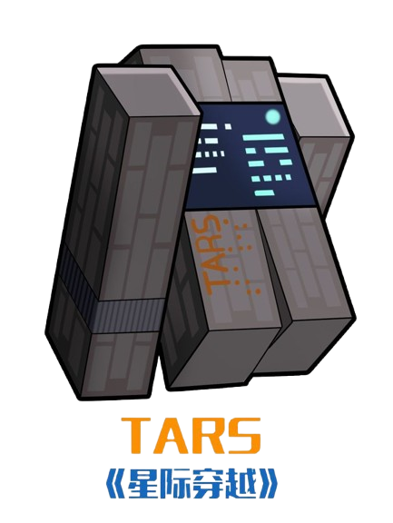

<div align="center">



**T A R S**

**An autonomous agent pipeline for [Claude Code](https://claude.ai/code).**

Spec-driven. Ticket-by-ticket. Adversarially reviewed. Gate-enforced.

*Honesty parameter: 100%. Your code merges when it earns it.*


</div>

---

## 🤖 What is tars?

You don't write code. You write **specs** and **tickets** with machine-checkable acceptance criteria — then tars drives a loop of sub-agents that plan, implement (test-first, on a task branch), and adversarially review each ticket, merging only when quality gates pass and the reviewer approves.

Humans steer at the spec and milestone level. TARS does the rowing.

Every step leaves an audit trail on GitHub: PRDs are parent issues, tickets are sub-issues, plans and reviews are issue comments, and completion is machine-readable — `<status>COMPLETE|BLOCKED</status>`, `<verdict>APPROVE|REJECT</verdict>`. No vibes, no "looks done".

## 🌊 The flow

```
/ask-tars        guided setup — interviews you about your project, then bootstraps it
/brainstorm      rough idea → sharper version: grounded in your codebase, with suggestions
/grill-me        stress-test your idea — the agent interviews you relentlessly
/grill-choices   audit the codebase's existing technical choices — defend each or flag it, on demand
/to-spec         conversation → spec: drafted in docs/specs/, published on approval as a PRD issue
/render-prd 12   PRD + its tickets as a self-contained HTML file, opened on request — on demand
/to-tickets      PRD → tracer-bullet tickets with blocking edges (sub-issues of the PRD)
/run-ticket 14   the loop: planner → implementer → gates → reviewer → merge
/run-frontier    AFK mode: unblocked tickets in parallel worktrees (max 3), serialized merges
/code-review     two-axis review (standards + spec) of any branch, on demand
/handoff         compact the session into a handoff doc for a fresh agent
/teach           learn a concept in a persistent local workspace — lessons, glossary, mastery checks
```

The issue tree on GitHub mirrors the plan:

```
🔶 #12  PRD: User authentication            ← tars:prd
 ├─ #14  Login form end-to-end             ← tars:ticket, blocked by: none
 ├─ #15  Session middleware                ← blocked by #14
 └─ #16  Password reset flow               ← blocked by #14
```

## 🔁 The loop (`/run-ticket`)

```
ticket ─▶ planner sub-agent      posts implementation plan (issue comment)
       ─▶ implementer sub-agent  TDD on task/<N> branch, runs the gates
              │ gates red ×5 → BLOCKED, escalate to human
       ─▶ reviewer sub-agent     re-runs gates, hunts vacuous tests/races/scope creep
              │ REJECT → back to implementer (max 3 cycles) → tars:blocked
       ─▶ APPROVE → merge --no-ff to main, close issue, log PROGRESS.md
```

## 🛰️ AFK mode (`/run-frontier`)

Computes the **frontier** — tickets whose blockers are all closed — and runs independent tickets concurrently:

- Each ticket gets its own **git worktree** at `../<repo>.worktrees/task-<N>-<slug>` (never inside your repo)
- Worktrees are **bootstrapped automatically**: gitignored `.env*` files copied over, dependencies installed, per-worktree port/database overrides applied (so 3 parallel test runs don't collide)
- Planners run **first**, and their file lists are the overlap oracle — two tickets touching the same files never run in parallel
- Merges are **serialized**: work is parallel, the merge point is a queue of one
- Parallelism cap: **3**

Scope it to one PRD with `/run-frontier 12`, or say "run until done" and walk away.

### Steering a running frontier

The worktree agents aren't sealed off — you have three channels:

1. **Relay through the main session** — say "tell ticket 14's implementer to use the existing session hook" and the orchestrator delivers it into that worktree's running agent, mid-flight. Works for questions too ("why are ticket 17's gates red?").
2. **Read the public trail** — plans, reviews, label flips, and commits all land outside the agent: `gh issue view 14 --comments`, `git -C ../<repo>.worktrees/task-14-... log`, or the GitHub UI.
3. **Take over the worktree** — when an agent finishes or blocks, its worktree stays on disk. `cd` in, start `claude`, continue interactively from where it stopped.

What you can't do is attach a second live session to a running agent — one driver per tree, by design. If you know upfront you'll want to babysit a ticket, run it with `/run-ticket` and leave the rest to the frontier.

### Working your own worktrees

For work outside a frontier run, start one Claude session per worktree — each session is anchored to its own directory:

```bash
cd ~/code/project-a && claude                                  # main checkout
cd ~/code/project-a.worktrees/task-14-login && claude          # ticket 14
cd ~/code/project-a.worktrees/task-17-rate-limit && claude     # ticket 17
```

Sessions don't share memory — carry context between them with `/handoff`, or point both at the same GitHub issue (tars keeps plans and reviews there precisely so every session shares one source of truth). Merge from the main checkout, one at a time.

## 📦 Install

```
/plugin marketplace add Sahilhawal/tars
/plugin install tars@tars
```

Available in every project, updates with the repo. Every push to `main` is a new version — refresh with `/plugin marketplace update tars`. Plugin skills are namespaced: `/tars:ask-tars`, `/tars:run-ticket`, etc.

## 🚀 Quickstart

In any project:

1. **`/ask-tars`** (or `/setup-tars` if you prefer the direct path) — scans your repo, agrees gate commands with you, creates the GitHub labels, `CLAUDE.md`, `CONTEXT.md`, and `docs/` structure. Once per project.
2. **`/brainstorm`** — bring a rough idea; leave with a sharper, codebase-grounded version of it.
3. **`/grill-me`** — the sharpened idea gets interviewed until it survives.
4. **`/to-spec`** — the conversation becomes a spec in `docs/specs/`. Approve it and it publishes as the **PRD issue**.
5. **`/to-tickets`** — the PRD breaks into tracer-bullet ticket sub-issues, each with machine-checkable acceptance criteria and declared blockers.
6. **`/run-ticket 14`** — or `/run-frontier` and go make coffee. ☕

## 🧱 What tars creates in your project

| Artifact | Where | Purpose |
|---|---|---|
| PRDs | GitHub issues (`tars:prd`) | The parent spec each feature hangs off |
| Tickets | GitHub sub-issues (`tars:ticket`) | Tracer-bullet slices with blocking edges |
| Plans & reviews | Issue comments | The audit trail, in the open |
| Gates | `CLAUDE.md` | Commands agents run verbatim — red gates, no merge |
| Glossary | `CONTEXT.md` | Domain vocabulary shared by code, tests, and agents |
| Decisions | `docs/adr/` | Architecture decisions code must not contradict |
| History | `docs/PROGRESS.md` | One line per merged ticket |

Labels: `tars:prd` · `tars:draft` (PRD under rework) · `tars:ticket` · `tars:ready` / `tars:in-progress` / `tars:blocked`.

No GitHub remote? Everything degrades to local files under `docs/` — you'll be told when it happens.

## 🧠 The agents

| Agent | Job | Rule it lives by |
|---|---|---|
| **planner** | Ticket → implementation plan (issue comment) | Read-only on the codebase. Plans, never writes. |
| **implementer** | TDD on the task branch until gates are green | Expected values from an independent source of truth, never recomputed like the code. |
| **reviewer** | Adversarial diff review, re-runs the gates | Default posture is REJECT. Approval is earned. |

## 🛠️ Requirements

- [Claude Code](https://claude.ai/code)
- [`gh` CLI](https://cli.github.com/), authenticated (PRDs and tickets are GitHub issues + sub-issues; local-file fallback exists)

## 📁 Layout

- `.claude-plugin/` — plugin + marketplace manifests (this repo is its own marketplace)
- `skills/` — the workflow (user-invoked orchestrators + model-invoked disciplines)
- `agents/` — the sub-agent contracts: planner, implementer, reviewer
- `templates/` — CLAUDE.md / CONTEXT.md seeds for new projects

## ❓ FAQ

**Does it write code without me?**
Yes — that's the point. You approve the spec, the ticket breakdown, and nothing else unless something blocks. Every merge required green gates and an adversarial reviewer's explicit APPROVE.

**What stops it from going off the rails?**
Machine-checkable acceptance criteria, gates that run verbatim, a reviewer whose default answer is REJECT, a 3-cycle cap before escalation, and a rule that acceptance criteria never change mid-loop to make a failing ticket pass.

**Can I run tickets in parallel?**
`/run-frontier` — up to 3, each in its own bootstrapped worktree, merges serialized. One blocked ticket never halts the frontier.

**Why "tars"?**
Named after the robot, not the archive format. It does exactly what its settings say it will.

## 🙏 Credits

Skill format, grilling, tdd, code-review, handoff, teach, and to-spec/to-tickets lineage: Matt Pocock's [skills](https://github.com/mattpocock/skills) (MIT). Completion signals, branch strategy, and structured verdicts inspired by [sandcastle](https://github.com/mattpocock/sandcastle).
