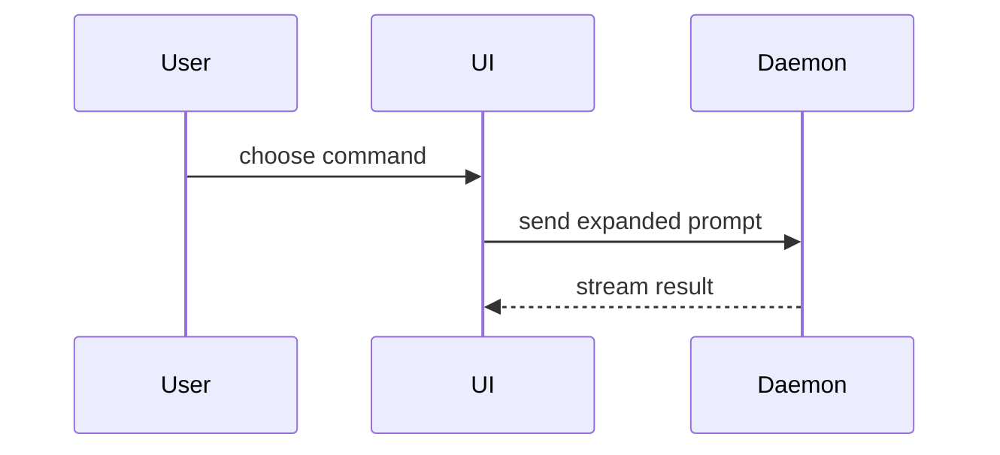

Skip the preamble and keep prose brief. Pick the smallest view that makes the point clear, then place it right next to the short text it supports.

You may use one of these, several, or none — it is unlikely you need all of them. Use judgement; don't overwhelm the user with visuals for a question that's answerable in a sentence.

## Views

- **Pseudocode** — logic or an algorithm:

```text
on(save)
  if content is unchanged
    return cached result
  write new content
  return fresh result
```

- **Call tree** — runtime control flow:

```text
submitForm
  createSession
    persistPrompt
    launchAgent
  navigateToSession
```

- **Component tree** — UI structure, including state and module boundaries that matter:

```tsx
<SessionPage> (apps/example/src/routes/session.tsx)
  useSessionEvents()
  <SessionToolbar>
    <RunSkillButton> (packages/ui)
```

- **File tree** — file responsibility or a broad refactor, kept shallow:

```text
src/
├── commands/       # parses user actions
├── sessions/       # owns session state
└── transport/      # sends API requests
```

- **Mermaid** — component interaction, control flow, or data flow:



- **Diff** — when the point is what changes and the surrounding shape already exists. Match the diff shape to the topic:

For a component change:

```diff
 <SessionPage>
   useSessionEvents()
   <SessionToolbar>
+    <RunSkillButton />
   <SessionTimeline>
+    <SkillResultCard />
```

For a file-layout change:

```diff
 src/
 ├── commands/
+│   └── show-me.ts       # expands the slash command
 ├── sessions/
-└── transport.ts
+└── transport/
+    ├── client.ts
+    └── stream.ts
```

For a call-tree or call-stack change:

```diff
 submitForm
   createSession
     persistPrompt
+    expandSkillMention
     launchAgent
-  navigateToSession
+  navigateToSession
+    subscribeToEvents
```

For a state or control-flow change:

```diff
 on(save)
-  write content
+  if content is unchanged
+    return cached result
+  write new content
+  invalidate cache
```

- **Whole code block** — show the full block, not a diff, when most of it is new, when omitted context would hide ownership or order, or when the user needs a copyable target shape:

```ts
function expandSkill(command: string): string {
  const skillName = command.slice(1)
  return `use the ${skillName} skill`
}
```

- **HTML artifact** — for a visual UI, layout, state comparison, or concept too dense for Mermaid, write one focused HTML file — a diagram, an infographic, or a short slide deck, whichever fits the point. Match the product's colors, type, spacing, and components; use real labels and data; support desktop and mobile. Then publish it with the Artifact tool (load `artifact-design` first) so the user can view and share it.

## Rule

Keep only the calls, files, props, states, and boundaries needed to answer the user's current question — no extra scaffolding around the view.
